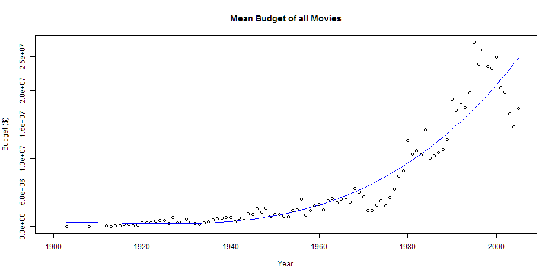
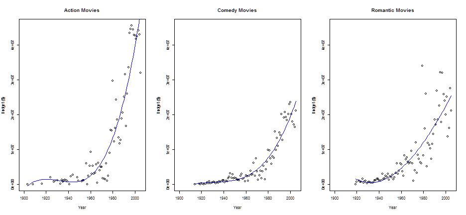
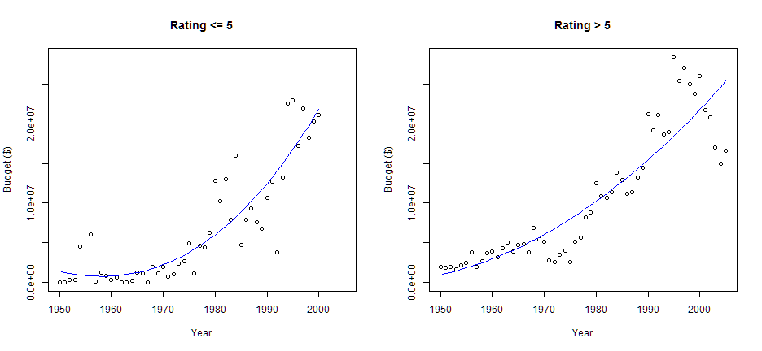

## Overview

The movies database (ggplot2 package) contains information and user ratings 
of 58788 movies from the internet movie database (IMDB.com). It is one of 
the biggest searchable movie database on the web and is run by amazon.

This application illustrates the development of movie budget between the
years 1900 and 2005 dependent on the movie creation year, the movie rating, 
and the movie genre.

It is shown that the increase in budget for action movies is twice as high
as for other genre movies.

It is shown the the budget is less and less independent of the movie rating.
Nowadays low-rated movies require about the same budget as high-rated movies.

--- 

### Movie Budget of all movies between 1900 and 2005

The following figure shows the increase of movie budget.
 
It illustrates the strong increase over the last 20 years.

 

---

### Budget of  Movies of different genres between 1900 and 2005

- For all movie genres the budget increases significantly
- The increase for action movies is about twice as high as for other genre movies

 

---

### Budget of low- and high-rated Movies between 1950 and 2005

Whereas the budget of low-rated movies was significantly lower in former years
the figures illustrate that in the last two decades the budget of low-rated movies (rating: 0-5) 
has increased significantly and nearly reached that of high-rated movies (rating: 5-10).

 

